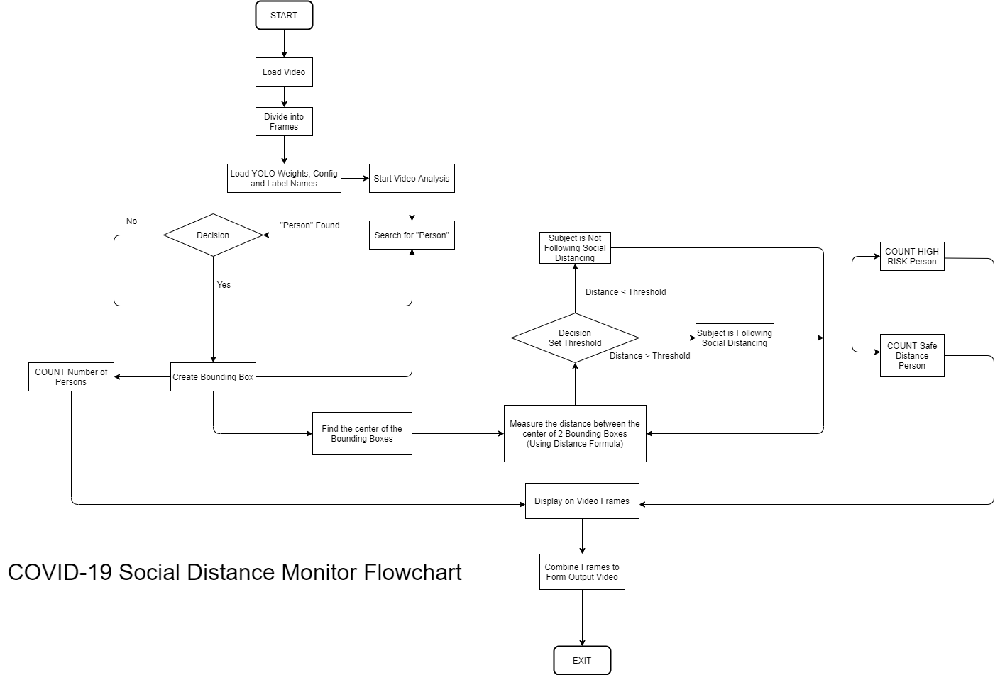

# COVID-19 SOCIAL DISTANCE MONITOR (PROJECT IDEATION)

### Introduction

Since the onset of COVID-19 that had grasp the entire population of Earth, the governments all around the world has been trying to come up with different measures to prevent it’s drastic spread. The World Health Organization has urged governments to practice Social Distancing norms to keep the spread of the virus in check. However, even after the spread of the virus is slowed down, and governments all across the globe lift up the countrywide lockdowns, it is necessary that the behaviour of the general public is kept in check. Social distancing still need to be practiced until the virus is completely eradicated. Therefore, this project aims to facilitate the process of checking social distancing practice by the authorities so that the general public remains safe from the deadly virus and also the economy keeps running. This algorithm can be fitted into any surveillance camera to analyse the behaviour of public and provide the insights for crowd control.

### Structure

In this project I am making use of the YOLOv3 object detection model to detect human beings in a given input video and predict the distance between them to ensure the practice of Social Distancing norm in COVID aftermath. 

In order to use the pre-trained YOLOv3 model, the weights, configuration and label names must be imported using the darknet framework. Next work is to define the distance formula function which will decide the distance between the persons in frame. Initially before proceeding forward, the confidence value and threshold values must be initialized so that it can determine the distance condition. 

Here, three conditions are being used:
    1. If the couple (2 persons in frame) is too close (High Risk)
    2. If the couple is at a certain distance but still close enough (Medium Risk)
    3. Safe distance (Safe Distance)

For every condition, the bounding box surrounding the person in frame must change colour as green, orange or red indicating the condition.

While forming the bounding box, the distance between the center of two bounding boxes must be determined. This is because the measurement of the distance between two person is done from this center point. Following the same threshold pattern, if the bounding boxes (or persons) are too near, the line showing the distances must be yellow in color (warning distance) and the line showing the “too close” distance must be red in color (danger distance). 

In order to make labelling clearer, a legend must be included in the openCV frame to make understanding clearer. The video frames are later combined to form the output video.

### Flow Chart

### Tools Used

    1. YOLOv3 Model: For the purpose of detecting the human figures in the input video, we are using a pre-built ‘You Only Look Once (YOLO) algorithm. This is a regression based computer vision algorithm which predict objects in an image frame. The algorithm is trained in the coco dataset.
    2. Darknet: It is a neural network framework which is used for implementation of the YOLO model. 
    3. OpenCV: For the purpose of viewing the video frames, creating bounding boxes and measuring the distance between the center of the bounding boxes, OpenCV is being used. It has multiple features which are bound to come handy in the project development.
    4. VLC Media Player: For playing the output video.

### Other Details
Language Written In:    Python 3.7
Environment (IDE):  Anaconda IDE (Jupyter Notebook/Spyder), PyCharm CE, VSCode

